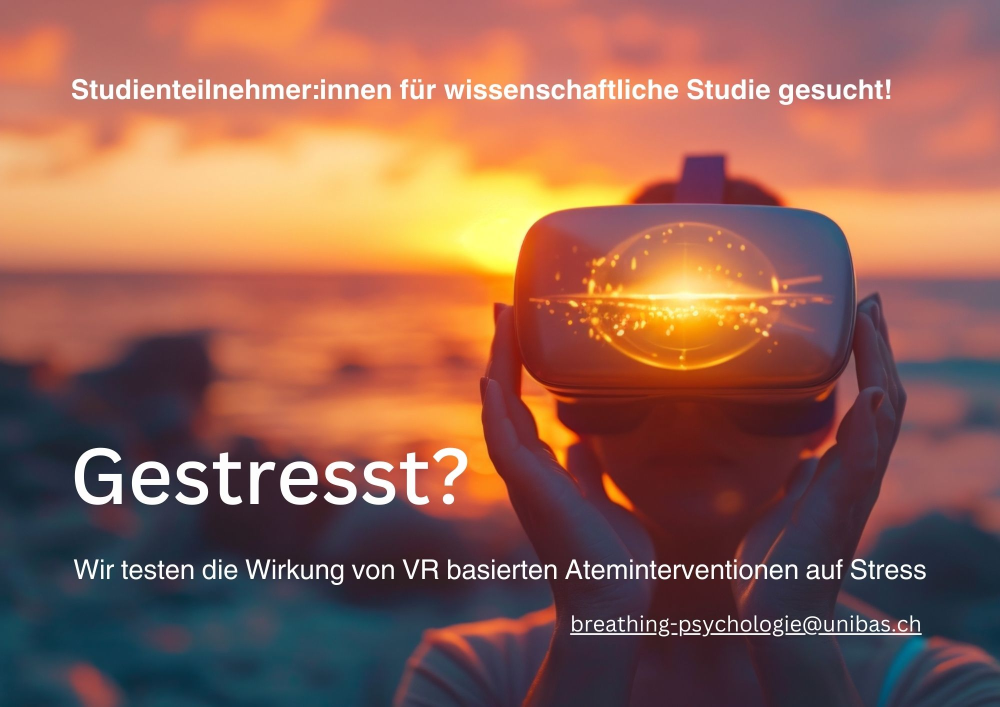

<div style="text-align: center; padding-top: 2em; font-size: 2.2em; font-family: 'sans-serif', sans-serif;">
Slow-Paced Breathing in VR 
</div>

<div style="text-align: center; font-size: 0.6em; color: #666; margin-top: 0.5em; margin-bottom: 1em;"> VOICE: FABIAN MUELLER | EXTRA: AMIRA BÜTTNER | PRODUCED: NEW MEDIA CENTER UNIVERSITY OF BASEL </div>

<video width="100%" autoplay muted>
  <source src="videos/breathing.mp4" type="video/mp4">
</video>


<div style="text-align: justify; font-size: 1em;">
<br>
Engage in a guided, slow-paced breathing VR training designed to reduce stress. We develop VR calming and rewarding VR experiences that promote relaxation and stress relief through guided breathing exercises.
</div>

 
<hr style="width:60%;">

<div style="text-align: center; padding-top: 0em; font-size: 1.2em; font-family: 'Alata', sans-serif;">
Assessing the Acute Effects of Virtual Reality-Based Breathing Interventions on Stress: A Pilot Study 

<br>

</div>


```{r, echo=FALSE, out.width = "100%"}


```
<div style="text-align: center; font-size: 1em; line-height: 1.7;">

Here is the flyer for our upcoming study, set to begin in October 2024. The official study website and the OSF preregistration will be launched by September.
</div>


<hr style="width:60%;">

<div style="text-align: center; font-size: 1.5em;">
<br>
More information coming soon.
</div>

<hr style="width:60%;">


```{r setup, include=FALSE}
knitr::opts_chunk$set(echo = FALSE)
```

```{css}
d-title {
    display: none;
  }
```


```{css}
table {
  border-bottom: none !important;
}

```
