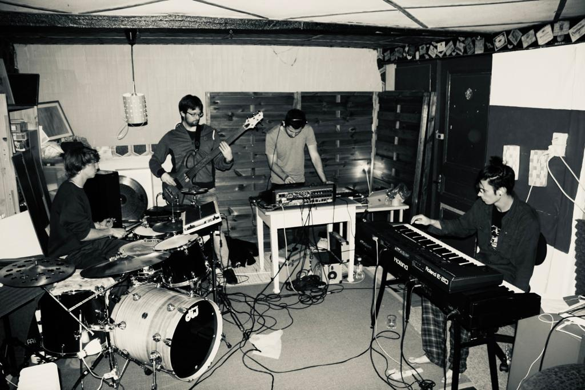
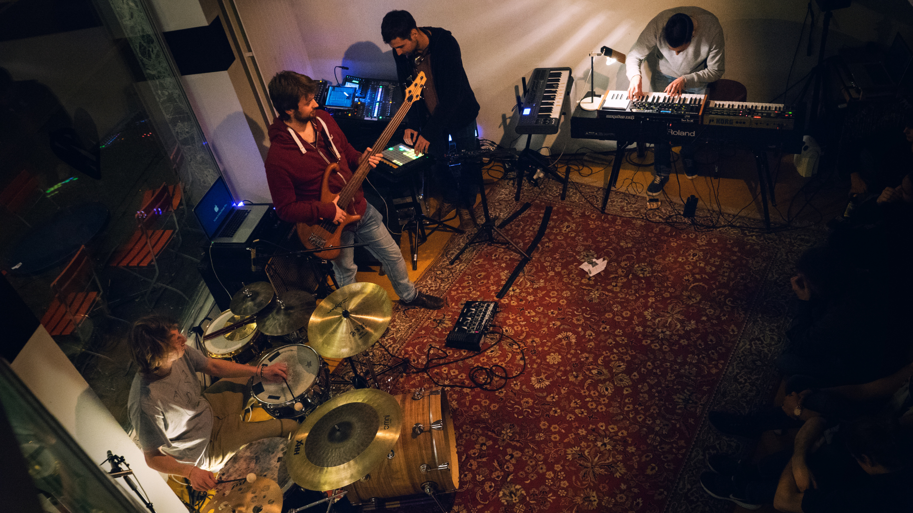
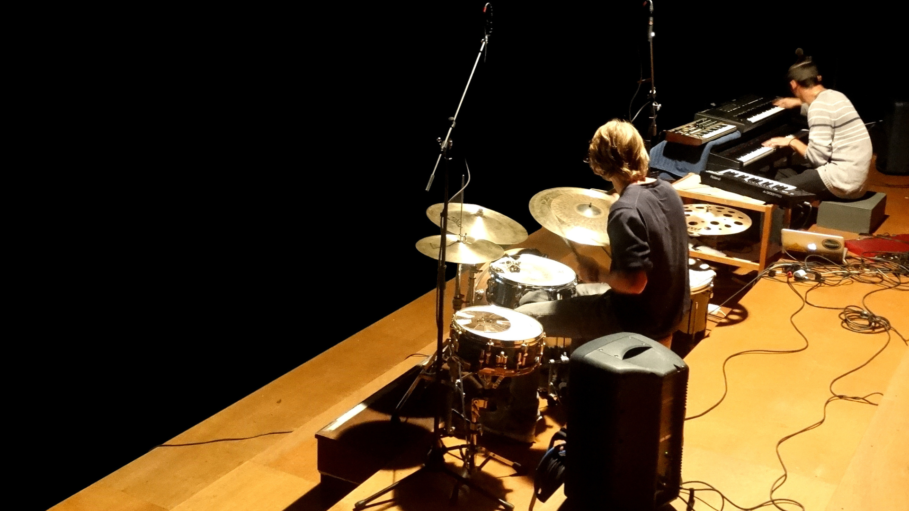

<div style="text-align: center; padding-top: 2em; font-size: 2.2em; font-family: 'sans-serif', sans-serif;">

Echtzeit
</div>

<div style="text-align: center; font-size: 0.6em; color: #666; margin-top: 0.5em; margin-bottom: 1em;"> ELEKTRONICS: JOSUA WEHNER | KEYS: SEVERIN SCHERRER | BASS: MARC ZÜST | DRUMS: FABIAN MUELLER </div>
```{r, echo=FALSE, out.width = "100%"}

```


<div style="text-align: justify;font-size: .9em;">
With our music quartet,  <i>Echtzeit</i>, we aimed to harmonize the lively essence of acoustic music with the technical possibilities of electronic music.
Drawing inspiration from jazz virtuosos such as Brad Mehldau and drummers like Jojo Mayers, we've crafted a unique sound that blends the rhythmic intensity of drum n bass with the complex harmonies of jazz.
</div>


<style>
#hoverTable img:hover {
  transform: scale(1.1);
  transition: transform 0.2s;
}
</style>

<table id="hoverTable" style="width:100%; text-align:center;">
  <tr>
    <td><a href="images/soundpics/ez1.png" target="_blank"></a></td>  
    <td><a href="images/soundpics/ez2.png" target="_blank"></a></td>
  </tr>
</table>


<!--  ```{r, echo=FALSE, results='asis'} -->
<!--  cat('<audio controls> -->
<!--         <source src="/sound/x.mp3" type="audio/mpeg"> -->
<!--         Your browser does not support the audio element. -->
<!--       </audio>') -->
<!--  ``` -->


<div style="text-align: center; padding-top: 0em; font-size: 1em;">

Check out our sound on <a href="https://open.spotify.com/artist/6TUKDMTrPvvHRQ5ypk6iLd?si=pJLo1vFuSO6zPmXm0VS8gQ">Spotify</a>. 
</div>
<!-- <style> -->
<!-- #hoverTable img:hover { -->
<!--   transform: scale(1.1); -->
<!--   transition: transform 0.2s; -->
<!-- } -->
<!-- </style> -->

<!-- <table id="hoverTable" style="width:100%; text-align:center;"> -->
<!--   <tr> -->
<!--     <td><a href="images/soundpics/roxy.jpg" target="_blank"></a></td>   -->
<!--     <td><a href="images/soundpics/ez_fs2.png" target="_blank"></a></td> -->
<!--   </tr> -->
<!-- </table> -->


```{r setup, include=FALSE}
knitr::opts_chunk$set(echo = FALSE)
```

```{css}
d-title {
    display: none;
  }
```


```{css}
table {
  border-bottom: none !important;
}

```
