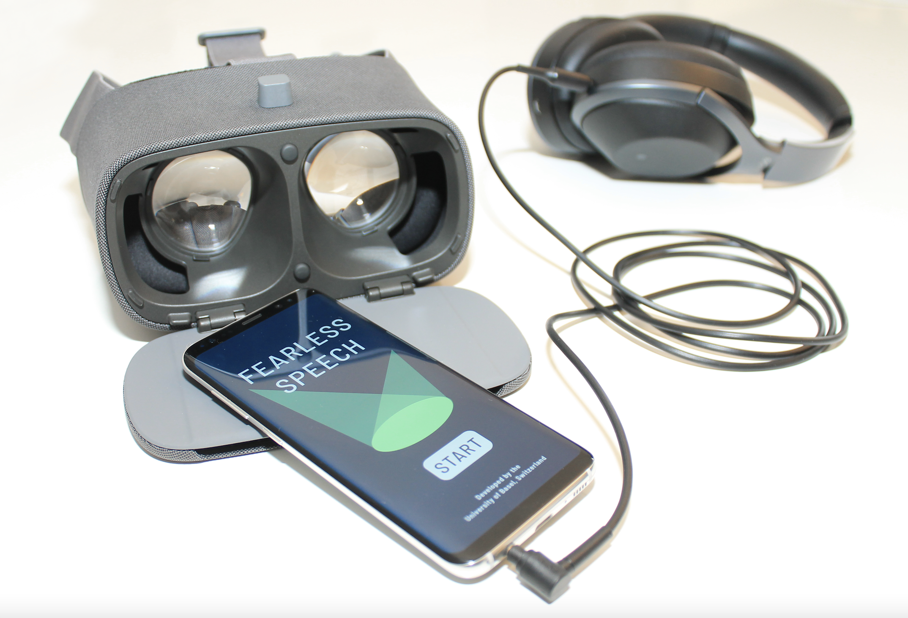
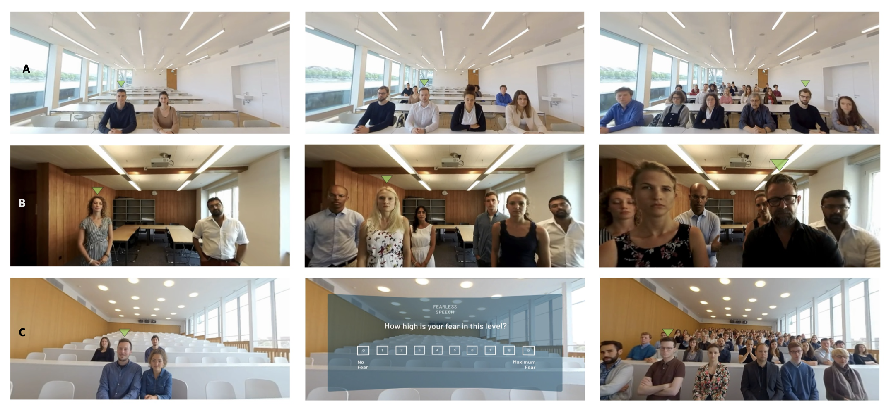
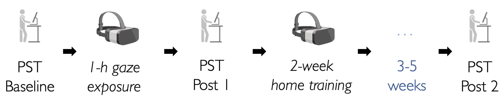
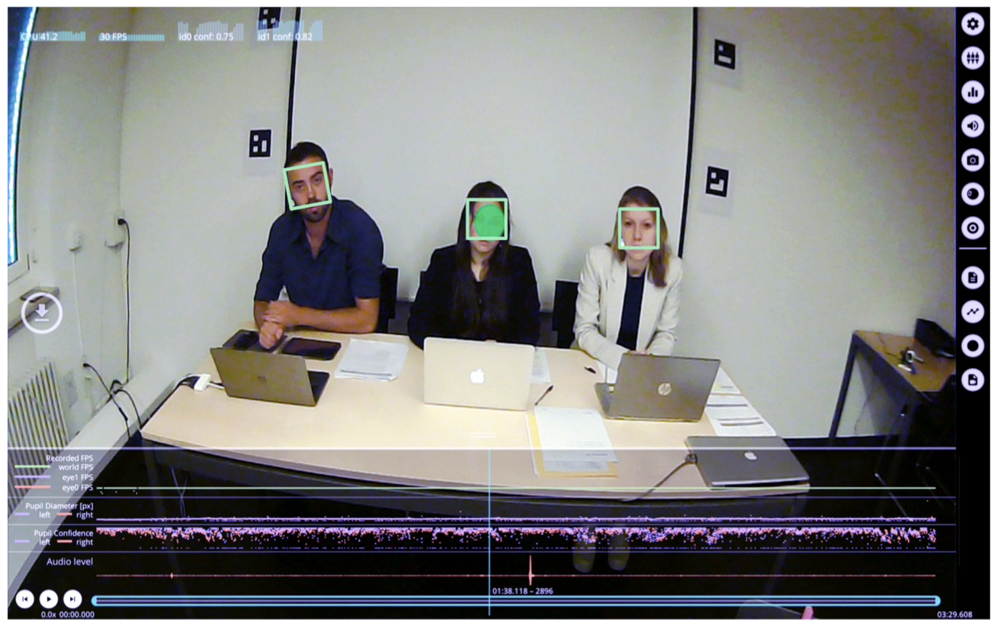
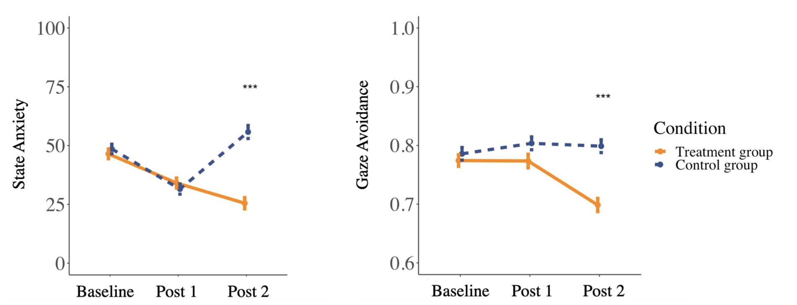

<div style="text-align: center; padding-top: 2em; font-size: 2.2em; font-family: 'sans-serif', sans-serif;">

Fearless Speech

</div>

<div style="text-align: center; padding-top: 0em; font-size: 1em;">

A Virtual Reality Gaze Exposure Treatment to Reduce Fear of Public Speaking  </div>
<hr style="width:60%;">

 ```{r, echo=FALSE, out.width = "100%"}
 
 
 ```
 <div style="text-align: justify;font-size: .9em;">

We developed a stand-alone gaze exposure treatment in virtual reality (VR) to test the potential of reducing gaze avoidance to reduce anxiety. The gaze exposure trained the maintenance of eye contact with audiences across progressively challenging social scenarios. 
</div>
<hr style="width:60%;">

<!-- <div style="text-align: left; padding-top: 0em; font-size: 1.2em; font-family: 'Alata', sans-serif;"> -->
<!-- Background -->
<!-- </div> -->

<!-- <div style="text-align: left;font-size: .9em;"> -->
<!-- • Public speaking anxiety (PSA) is a prevalent social anxiety, affecting up to 30% of the population. <br> -->
<!-- • PSA is characterized by fear of being evaluated by others and the avoidance of eye contact.<br> -->
<!-- • Gaze avoidance may be driven by a desire to reduce state anxiety but maintain anxiety in the long term.<br> -->
<!-- • We developed a stand-alone gaze exposure treatment in virtual reality (VR) to test the potential of reducing gaze avoidance to reduce anxiety. <br> -->

<!-- </div> -->

<div style="text-align: left; padding-top: 0em; font-size: 1.2em; font-family: 'Alata', sans-serif;">
VR Gaze Exposure Application
</div>

<!-- <div style="text-align: left;font-size: .9em;"> -->
<!-- The gaze exposure trained the maintenance of eye contact with audiences across progressively challenging social scenarios.  -->
<!-- </div> -->

 ```{r, echo=FALSE, out.width = "100%"}
 
 
 ```
<div style="text-align: justify;font-size: .7em; line-height: 1.7;">
The figure displays a classroom (A), proximity (B), and lecture hall scenario (C) used in the gaze exposure treatment. From left to right, the social scenario increases in difficulty, with differences in audience size, proximity, and facial expressions. A green arrow indicates a target person for maintaining eye contact. After successfully holding eye contact with the target person over a predefined time as measured by gaze tracking, the arrow switched to the next target person to prompt a change of eye contact. Each level was repeated until the overall eye contact maintenance exceeded a predefined time threshold ranging from 56 to 96 seconds, depending on the level, and the user indicated low anxiety (i.e., < 3) on a state anxiety rating.
</div>

<hr style="width:60%;">

<div style="text-align: center; padding-top: 0em; font-size: 1.2em; font-family: 'Alata', sans-serif;">
See here how this works...
</div>


<iframe width="560" height="415" src="https://www.youtube.com/embed/dYXLMkK_B2o?si=PSUBeo2vFrbB3TFc" title="YouTube video player" frameborder="0" allow="accelerometer; autoplay; clipboard-write; encrypted-media; gyroscope; picture-in-picture; web-share" referrerpolicy="strict-origin-when-cross-origin" allowfullscreen></iframe>


<hr style="width:60%;">


<div style="text-align: left; padding-top: 0em; font-size: 1.2em; font-family: 'Alata', sans-serif;">
Study Design 
</div>
<div style="text-align: justify;font-size: .9em;">
In a single-blind, randomized controlled trial, we evaluated the effectiveness of exposure to gaze in reducing state anxiety. Eighty-nine adult participants with subclinical PSA were assigned to either a gaze exposure treatment or a control group.<br></div>
<br>

```{r, echo=FALSE, out.width = "100%"}


```
<div style="text-align: justify;font-size: .7em; line-height: 1.7; ">
Assessments occurred at baseline, following a one-hour acute intervention (Post 1), and three to five weeks after a two-weeks home treatment (Post 2). At each assessment, participants conducted a public speaking test (PST, see below). After a baseline PST, the participants of the treatment group underwent the gaze exposure treatment in VR for 3 × 20 min, while the participants of the control group explored virtual scenarios without social content. The second PST followed the procedure as the first one. Subsequently, the treatment group completed 9 × 20 min home treatment sessions with the gaze exposure app, while the control group did not receive any task. Three to five weeks after treatment completion of the treatment group, a third public speaking test was conducted.
</div>

<hr style="width:60%;">

<div style="text-align: left; padding-top: 0em; font-size: 1.2em; font-family: 'Alata', sans-serif;">
Public Speaking Test 
</div>
<div style="text-align: justify;font-size: .9em;">
We tested treatment effects in a real-life public speaking situation. The primary Outcome was state anxiety during public speaking, assessed using the Subjective Units of Distress Scale.
The main secondary outcome was gaze avoidance during public speaking, as measured by eye-tracking. 
<br></div>
<br>


```{r, echo=FALSE}


```
<div style="text-align: justify;font-size: .7em; line-height: 1.7; ">
The figure displays the view of the participant during the real-life public speaking test as recorded through a mobile eye-tracking system The public speaking test (PST) comprised ten minutes of semi-improvised speeches in front of an evaluation committee. Before the first and after every speech, participants indicated their state anxiety level on the Subjective Units of Distress Scale. During the speeches, we used eye tracking and a face detection algorithm to quantify gaze avoidance as the relative dwell time off faces of any committee members during public speaking. Here, A video frame is shown, recorded from the world camera of a mobile eye tracking system, representing a participant’s perspective during the public speaking test.
</div>

<hr style="width:60%;">

<div style="text-align: left; padding-top: 0em; font-size: 1.2em; font-family: 'Alata', sans-serif;">
Results 
</div>


```{r, echo=FALSE}


```

<div style="text-align: justify;font-size: .7em; line-height: 1.7; ">
The figure displayes the effects of the gaze exposure treatment on state anxiety and gaze avoidance during public speaking. Linear mixed models' analyses suggested no reduction regarding state anxiety or the relative dwell time off faces during the public speaking test in the treatment group immediately after 1-h gaze exposure (Post 1) compared to the control group. However, there was a beneficial effect on state anxiety (cohens d' = 1.07) and gaze avoidance (cohens d’ = - 0.97) after additional home treatment (9 × 20 min), as evident by the difference between the groups one month after the intervention (Post 2).
</div>


<hr style="width:60%;">

<div style="text-align: left; padding-top: 0em; font-size: 1.2em; font-family: 'Alata', sans-serif;">
Implications 
</div>


<div style="text-align: left;font-size: .9em;">
• A two-week VR gaze exposure reduces state anxiety during public speaking. <br>
• VR gaze exposure requires no exposure to real people or any verbal interaction.<br>
• VR exposure apps offer accessible self-help tools at a low initiation threshold. <br>

</div>

<hr style="width:60%;">

<div style="text-align: left; padding-top: 0em; font-size: 1.2em; font-family: 'Alata', sans-serif;">
Publication
</div>

<div style="text-align: left;font-size: .9em; line-height: 1.7;">
Virtual reality gaze exposure treatment reduces state anxiety during public speaking in individuals with public speaking anxiety: A randomized controlled trial @ <a href="https://www.sciencedirect.com/science/article/pii/S2666915323001658?via%3Dihub">Journal of Anxiety Disorders Reports</a>
</div>


<div style="font-size: .9em; line-height: 1.7; margin-bottom: .9em;">
  <p>
    Bernhard Fehlmann<sup>1,5</sup>, 
    Fabian D Mueller<sup>1,5</sup>, 
    Nan Wang<sup>1,5</sup>, 
    Merle K Ibach<sup>1,5</sup>, 
    Thomas Schlitt<sup>2,5</sup>, 
    Dorothée Bentz<sup>1,5</sup>, 
    Anja Zimmer<sup>1,5</sup>, 
    Andreas Papassotiropoulos<sup>2,3,4,5</sup>, 
    Dominique JF de Quervain<sup>1,4,5</sup>
  </p>
  <ol style="list-style-type: decimal; margin: 0; padding-left: 1em; font-size: .6em; line-height: 1.0;">
    <li>Bernhard Fehlmann & Fabian D Mueller contributed equally to this work</li>
    <li>Division of Cognitive Neuroscience, Department of Biomedicine, University of Basel, Birmannsgasse 8, Basel 4055, Switzerland</li>
    <li>Division of Molecular Neuroscience, Department of Biomedicine, University of Basel, Basel 4055, Switzerland</li>
    <li>Life Sciences Training Facility, Department Biozentrum, University of Basel, Basel 4056, Switzerland</li>
    <li>University Psychiatric Clinics, University of Basel, Basel 4002, Switzerland</li>
    <li>Research Cluster Molecular and Cognitive Neurosciences, University of Basel, Basel 4055, Switzerland</li>
  </ol>
</div>


<hr style="width:60%;">


<div style="text-align: left; padding-top: 0em; font-size: 1.2em; font-family: 'Alata', sans-serif;">
Poster
</div>

<div style="font-size: .9em; line-height: 1.7; margin-bottom: 1em;">
This work was presented at the 26th Annual CyberPsychology, CyberTherapy & Social Networking Conference 
  <a href="https://www.interactivemediainstitute.com/cypsy26/" target="_blank" style="text-decoration: none; color: #1a73e8;">(CYPSY26)</a>.  It was honored with the 2023
  <a href="https://www.interactivemediainstitute.com/cypsy26/awards-honors/" target="_blank" style="text-decoration: none; color: #1a73e8;">Young Minds Research Award</a>.
</div>

<div style="text-align: center; margin-bottom: 2em;">
  <a href="pdf/assistposter.pdf" target="_blank" style="text-decoration: none;">
    
  </a>
  <div style="font-size: .8em; color: #555; margin-top: 0.5em;">Click the poster to view the full PDF</div>
</div>


<hr style="width:60%;">

<!-- <div style="text-align: left; padding-top: 0em; font-size: 1.2em; font-family: 'Alata', sans-serif;"> -->
<!-- Poster   -->
<!-- </div> -->

<!-- <div style="text-align: left;font-size: .7em; line-height: 1.7;"> -->
<!-- Presented @ 26th Annual CyberPsychology, CyberTherapy & Social Networking Conference<a href="https://www.interactivemediainstitute.com/cypsy26/">(CYPSY26)</a> -->
<!-- </div> -->

<!-- {width=700px height=500px} -->


<div style="text-align: left; padding-top: 0em; font-size: 1.2em; font-family: 'Alata', sans-serif;">
In the News  
</div>

<div style="text-align: left;font-size: .9em;">
•  <a href="https://www.swissinfo.ch/ger/alle-news-in-kuerze/forscher-testen-virtuelles-training-gegen-vortragsangst/45096766">SwissInfo</a>
•  <a href="https://www.watson.ch/digital/schweiz/290837386-vortragsangst-forscher-der-uni-basel-entwickeln-app">Watson</a>
•  <a href="https://www.handelszeitung.ch/digital-switzerland/haben-sie-bammel-vor-vortragen-eine-app-konnte-bald-helfen">Handelszeitung</a>
•  <a href="https://www.handelszeitung.ch/beruf/virtuelle-hilfe-gegen-das-lampenfieber">Bilanz</a>
•  <a href="https://www.blick.ch/wirtschaft/psychologie-forscher-testen-virtuelles-training-gegen-vortragsangst-id15420090.html">Blick</a>

</div>


```{r setup, include=FALSE}
knitr::opts_chunk$set(echo = FALSE)
```

```{css}
d-title {
    display: none;
  }
```

