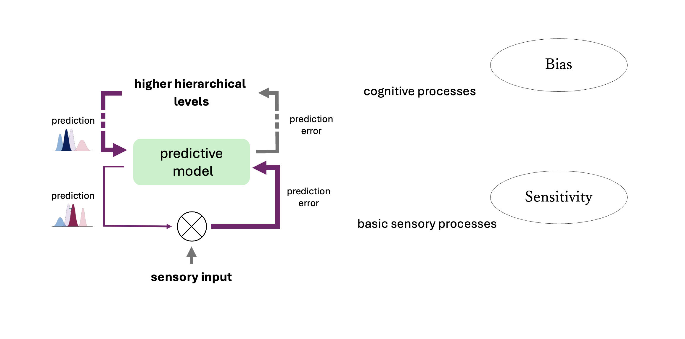

<div style="text-align: center; padding-top: 2em; font-size: 2.2em; font-family: 'sans-serif', sans-serif;">

How does our brain shape what we see?
<br><br>
</div>

<div style="text-align: center;font-size: 1em;">
In this video, we explains how scientists think hallucinations occur in the brain by introducing the <a href="https://pubmed.ncbi.nlm.nih.gov/38424472/">Predictive Processing framework</a>. 
<br>
<br>


</div>

<iframe width="560" height="415" src="https://www.youtube.com/embed/8ctpcP6ExXs?si=1re21ViJQMmnm2nQ" title="YouTube video player" frameborder="0" allow="accelerometer; autoplay; clipboard-write; encrypted-media; gyroscope; picture-in-picture; web-share" referrerpolicy="strict-origin-when-cross-origin" allowfullscreen></iframe>

<div style="text-align: center; font-size: 0.6em; color: #666; margin-top: 0.5em; margin-bottom: 1em;"> IDEA: FABIAN MUELLER | PRODUCED: NEW MEDIA CENTER </div>


<!-- <div style="text-align: justify;font-size: 1em;"> -->
<!-- <br> -->

<!-- According to the Predictive Coding hypothesis of psychosis, hallucinations are thought to arise from aberrant perceptual inference due to imprecise integration of internal predictions and incoming sensory data. However, it remains inconclusive whether perceptual disturbances in psychosis originate from abnormal perceptual sensitivity, heightened sensory expectations, or both. -->

<!-- <br> -->
<!-- </div> -->

<!-- ```{r, echo=FALSE} -->
<!--  -->

<!-- ``` -->

<!-- <div style="text-align: center;font-size: .7em; line-height: 1.7; "> -->
<!-- Adapted from: Sterzer, P., et al., (2018). Biological psychiatry. -->
<!-- </div> -->

<!-- <br> -->
<!-- <br> -->

<div style="text-align: justify; font-size: 1em;">
<br>
  <br>
Learn more about our <a href="https://fabiandmueller.github.io/psychosis.html" target="_blank" style="text-decoration: none; color: #1a73e8;">ongoing study</a>, where we use VR to induce hallucination-like phenomena to disentangle the perceptual decision-making factors that contribute to the emergence of visual disturbances.

  <br>
  <br>

</div>


```{r setup, include=FALSE}
knitr::opts_chunk$set(echo = FALSE)
```


```{css}
d-title {
  display: none;
}

table {
  border-bottom: none !important;
}

footer {
  width: 100%;
  text-align: center;
}

```
