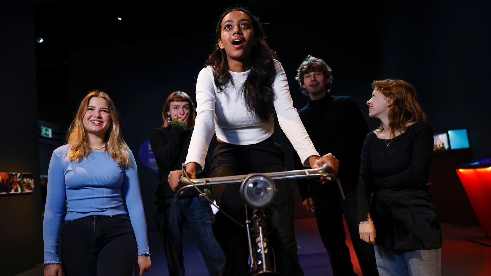
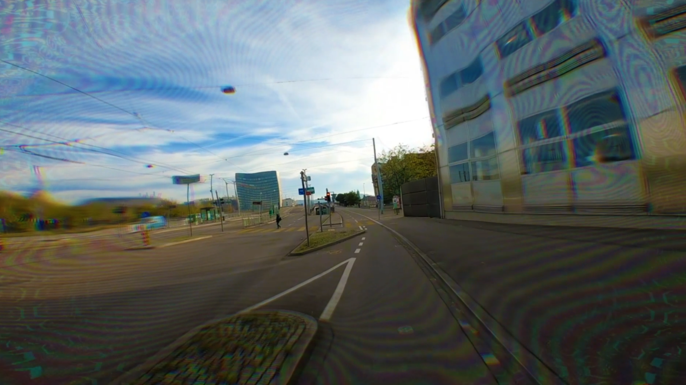

<div style="text-align: center; padding-top: 2em; font-size: 2.2em; font-family: 'Alata', sans-serif;">

Hoffman's First Ride

</div>

<div style="text-align: center; padding-top: 0em; font-size: 1em;">

Interactive installation presented at the <a href="https://www.bhm.ch/de/ausstellungen/wechselausstellungen/rausch-extase-rush">Rausch - Extase - Rush Exhibition</a>,  <br> Historical Museum in Bern.


</div>


```{r, echo=FALSE, out.width = "100%"}


```

<div style="text-align: center;font-size: .9em;">

Partnering with Raimonds Jermaks (<a href="https://www.symmetric-vision.xyz/">Symmetric-Vision</a>), we created an interactive video installation that brings to life Albert Hoffmann's first LSD trip, an event that occurred quite by accident in his laboratory in Basel. The installation invites participants to mount a bicycle, the pedalling of which triggers a captivating video, in which the visual effects of LSD gradually increase over time. <br><br>

</div>
<!-- <br style="line-height:10%;" /> -->

```{r, echo=FALSE, out.width = "100%"}


```

<div style="text-align: center; padding-top: 0em; font-size: .9em;">

The video is based on the path that Albert Hoffman took on his historic bicycle ride home, a journey during which he became the first human to ever experience the profound effects of LSD. 
</div>

<hr style="width:60%;">


<div style="text-align: center; padding-top: 0em; font-size: 1.2em; font-family: 'Alata', sans-serif;">
Here's the full video ...
</div>


<video width="100%" controls>
  <source src="videos/Ride_v4.mp4" type="video/mp4"> </video>


<div style="text-align: center; font-size: .9em;">
<br>
<strong>Disclaimer:</strong> There is much more to psychedelic experiences than just funky visuals. We do not claim that this visualization captures the nature of such. 
</div>


```{r setup, include=FALSE}
knitr::opts_chunk$set(echo = FALSE)
```

```{css}
d-title {
    display: none;
  }
```


