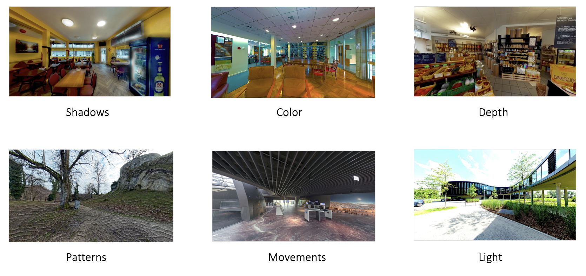
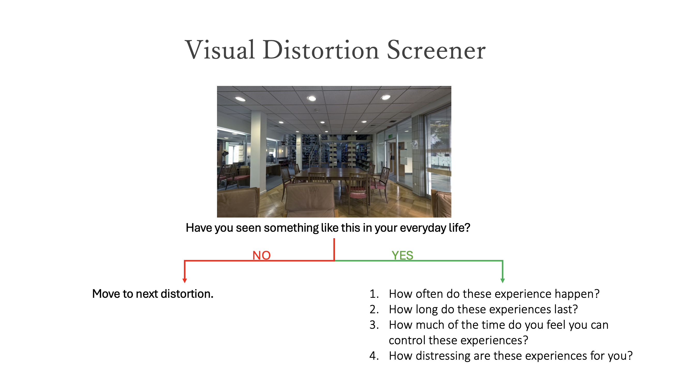
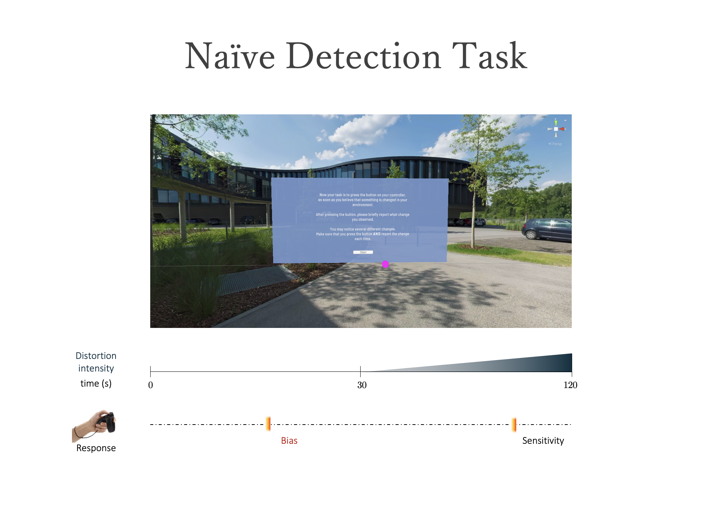
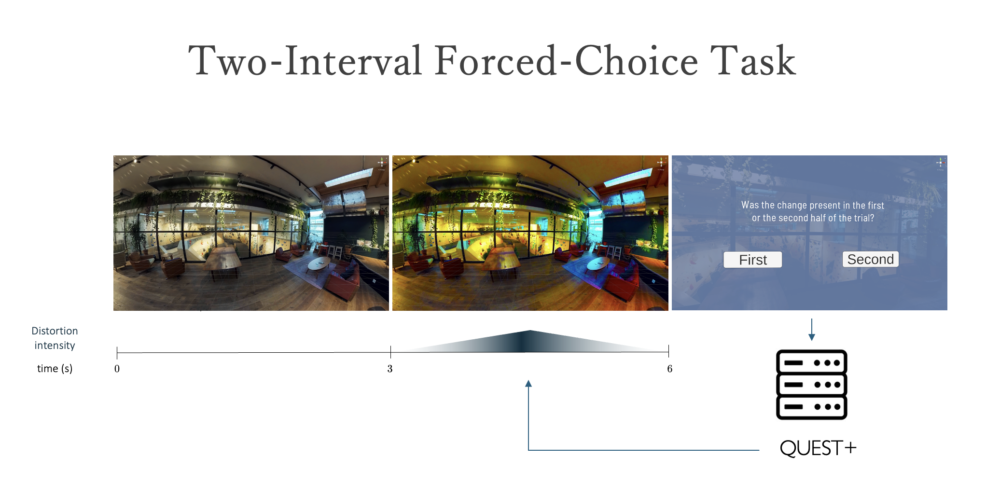
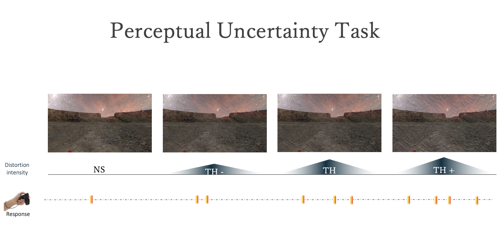
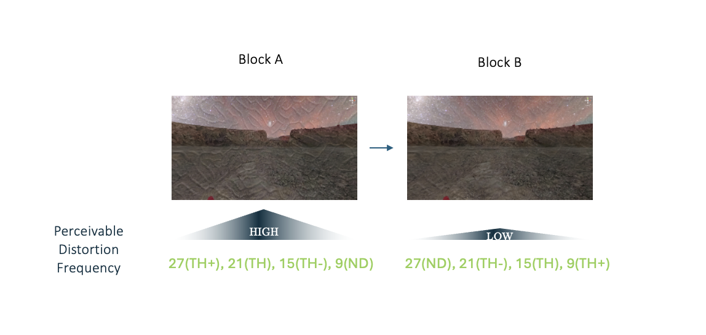
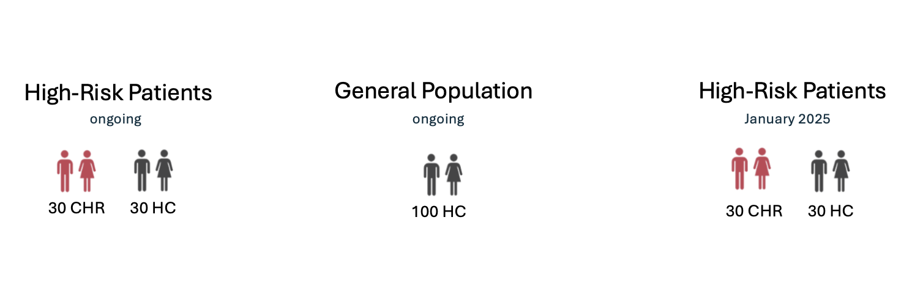

<div style="text-align: center; padding-top: 4em; font-size: 1.5em; font-family: 'Cardo', serif;">
"In our opinion, prevention of psychosis in the pre-psychotic precursor stages is possible."
</div>
<div style="text-align: right; padding-top: 0.5em; font-size: 1em; font-family: 'Cardo', serif;">
— Gerd Huber, 1987
</div>

<hr style="width:60%;">


<!--  <div style="text-align: justify;font-size: 1em;"> -->

<!-- Psychosis is characterized by hallucinations and delusions (fixed false beliefs). However, for most patients, the onset of full-blown psychotic symptoms is preceded by subtler changes in perception, thought and beliefs. Take a closer look at Mona. Do you notice anything unusual? <br> -->

<!-- </div> -->


<!-- <div style="text-align: center; padding-top: 2em;"> -->
<!-- <video width="50%" controls autoplay muted> -->
<!--   <source src="videos/Mona_trimmed.mp4" type="video/mp4"> </video> -->
<!-- </div> -->


<!--  <div style="text-align: justify;font-size: 1em;"> -->
<!-- Although the experience of looking at the Mona Lisa is an obvious illustration, consider how changes in perceptioncan influence your feelings and thoughts about the world. But beyond fostering empathy for those affected, one core question we ask is, wether we can identify individuals at risk for psychosis before the onset of full-blown symptoms? <br> -->
<!--  <br> -->

 


<table border="0">
  <tr>
    <td style="width: 50%; padding-right: 1em; text-align: justify; vertical-align: top; font-size: 1em;">
      Psychosis is characterized by hallucinations and delusions (fixed false beliefs). However, for most patients, the onset of full-blown psychotic symptoms is preceded by subtler changes in perception, thought and beliefs. Take a closer look at Mona. Do you notice anything unusual? <br>
      Although the experience of looking at the Mona Lisa is an obvious illustration, consider how changes in perception can influence your feelings and thoughts about the world. <br>But beyond fostering empathy for those affected, one key question we care about is whether we can identify individuals at risk for psychosis before the onset of full-blown symptoms. To address this question, we investigate the prevalence and mechanisms of perceptual distortions in psychosis.
    </td>
    <td style="width: 50%; text-align: center;">
      <video width="100%" controls autoplay muted>
        <source src="videos/Mona_trimmed.mp4" type="video/mp4">
      </video>  <br>
    </td>
  </tr>
</table>


<!-- <div style="text-align: center; padding-top: 2em; overflow: hidden; display: flex; justify-content: center; align-items: center; height: 300px;"> -->
<!--   <video width="100%" controls autoplay muted style="object-fit: cover; height: 500px;"> -->
<!--     <source src="videos/Mona_trimmed.mp4" type="video/mp4"> -->
<!--   </video> -->
<!-- </div> -->


<!-- <div style="text-align: left; padding-top: 0em; font-size: 1.2em; font-family: 'Alata', sans-serif;"> -->
<!-- <br><br> Visual Distortions in Psychosis -->
<!-- </div> -->


<div style="text-align: center; padding-top: 4em; font-size: 1.5em; font-family: 'Cardo', serif;"> 
<!-- <div style="text-align: center; padding-top: 0em; font-size: 1.2em; font-family: 'Alata', sans-serif;"> -->
Simulating Psychosis-Like Visual Distortions in VR
</div>


 ```{r, echo=FALSE, out.width = "100%"}
 
 
 ```
 
<div style="text-align: justify; font-size: 1.1em;">

<br> Visual distortions in individuals at high risk for psychosis are associated with a poor prognosis, including conversion to full-blown psychosis. We have collaborated with <a href="https://www.symmetric-vision.xyz/">Symmetric Vision</a>, a visual artist, to simulate some of the most commonly reported visual distortions in virtual reality (VR). Here we display a set of six visual distortions, comprising alterations in brightness, metachromopsia (color alterations), visual patterns, pseudo-movement, and peripheral shadows.

<br></div>

 
<!--  <div style="text-align: justify;font-size: .7em; line-height: 1.7; "> -->
<!-- Visual distortions simulations, that we generated based on 360° videos recorded in Basel, Switzerland in various settings of daily life (e.g., gym, park, and restaurant) and openly available online materials (<a href="www.eso.org">www.eso.org</a>). These videos were provided to a visual artist, along with descriptions of visual distortions commonly experienced by patients on the psychosis spectrum. Psychotic-like visual distortions were superimposed onto the 360° base materials across different VR scenarios. Here we display a set of six visual distortions, comprising alterations in brightness, metachromopsia (color alterations), visual patterns, pseudo-movement, and peripheral shadows. -->
<!-- </div> -->

<hr style="width:60%;">


<!-- <div style="text-align: center; padding-top: 4em; font-size: 1.5em; font-family: 'Cardo', serif;"> -->
<!-- On the clinical side ... -->
<!-- </div> -->

<div style="text-align: left; padding-top: 0em; font-size: 1.2em; font-family: 'Alata', sans-serif;">
On the clinical side ...
</div>


<div style="text-align: justify; font-size: 1em;">
Based on these VR simulations, we have developed a <a href="https://redcap.research.yale.edu/surveys/?s=5778BwMMjiwuGUC6">Visual Distortion Screener</a> to show these simulations both on a computer screen and in VR. The screener is designed to assess experiences of visual distortions in patients on the psychosis spectrum by providing visual illustrations. Unlike earlier measures, our novel semi-structured interview does not rely on verbal descriptions of visual phenomena, which could hinder accurate reporting of experienced symptoms.
<br></div>
<br>


```{r, echo=FALSE}


```


<div style="text-align: justify;font-size: 1em; line-height: 1.7; ">
After showing the videos, the screener asks the user to briefly describe the visual distortion to confirm that it was correctly recognized. Subsequently, the screener asks, “Have you seen something like this in your everyday life?” If the participant endorses having experienced the distortion, they will be asked a set of questions probing the frequency, duration, intrusiveness, and distress of the distortion within the past month and during the “worst time.”

</div>

<hr style="width:60%;">


<!-- <div style="text-align: center; padding-top: 4em; font-size: 1.5em; font-family: 'Cardo', serif;"> -->
<!-- On the mechanistic side ...   -->
<!-- </div> -->

<div style="text-align: left; padding-top: 0em; font-size: 1.2em; font-family: 'Alata', sans-serif;">
On the mechanistic side ...
</div>


<br>
<div style="text-align: justify; font-size: 1em;">
  We are investigating what drives visual disturbances more broadly, including the occurrence of hallucinations. Hallucinations are classically defined as perception-like experiences that occur without an external stimulus. Hallucinations are not limited to psychotic disorders but also occur in the general population, suggesting a continuum from attenuated to more severe forms of hallucinatory experiences. We have developed three novel perceptual decision-making tasks in VR that are aimed at inducing hallucination-like percepts and disentangling the perceptual decision-making factors that contribute to the emergence of visual disturbances. These tasks are:
</div>

<ul style="text-align: left; font-size: 1em;">
    <li>Naïve Detection Task, probing participants' spontaneous susceptibility to false perceptions and visual sensitivity when only knowing that there may be visual changes.</li>
    <li>Two-Interval Forced-Choice (2-IFC) Task, isolating visual sensitivity from cognitive bias using a psychophysical procedure.</li>
    <li>Perceptual Uncertainty Task, inducing false percepts by varying perceptual uncertainty over time.</li>
</ul>


<hr style="width:60%;">


```{r, echo=FALSE}


```
<div style="text-align: justify;font-size: 1em; line-height: 1.7; ">
With the Naïve Detection Task, we assess spontaneous false percepts and perceptual sensitivity in detecting an unknown visual distortion in naturalistic VR scenarios. To do this, participants are placed in a VR environment for two minutes and their task is to report, as soon as they believe that something has changed. Importantly, participants do not know about the following task structure. For the initial 30 seconds of the task, no changes are introduced to capture potential false (imagined) change detections. Then, one of the visual distortion is faded in gradually over 90 seconds to measure at what itensity the target distortions is correctly identified. Throughout this task, we record all button presses, and corresponding verbal reports as well as gaze behavior as a measure of visual exploration. 

</div>

<hr style="width:60%;">

<div style="text-align: justify;font-size: 1em; line-height: 1.7; ">

A drawback of the Naïve Detection Task is that, that we cannot  discriminate perceptual sensitivity from change blindness, memory effects or cognitive response tendencies, like differing decision criteria. And these will likely contribute to the assessment of sensitivity with this task. So, to rule out such confounding variables, in the next task, we determine sensitivity in terms of perceptual thresholds.
</div>


```{r, echo=FALSE}


```
<div style="text-align: justify;font-size: 1em; line-height: 1.7; ">
The Two-Interval Forced-Choice (2-IFC) Task is aimed at isolating visual sensitivity from cognitive bias using a psychophysical procedure. In this task, we present participants with a distortion either in the first or the second half of a trial. After each trial, participants have to decide whether the change was present in the first or the second half. This task is combined with an adaptive staircase procedure that estimates the threshold after each response and presents this estimated intensity in the next trial. This process is repeated until, after around 50 trials, we obtain relatively robust threshold estimates as a cleaner measure of perceptual sensitivity towards the visual distortions.

</div>

<hr style="width:60%;">


```{r, echo=FALSE}


```
<div style="text-align: justify;font-size: 1em; line-height: 1.7; ">
The Perceptual Uncertainty Task was designed to induce hallucination-like false percepts through perceptual ambiguity in a more natural and continuous VR experience. Over a duration of 10 minutes, participants will be presented with distortions at their threshold, slightly above or below, as well as in distortion-absent trials. The task for the participants is to press a button whenever they believe they perceive a change. Although participants won't be aware of the different trials, we will collect response rates across the different stimulus intensities, as well as in the distortion-absent trials.

```{r, echo=FALSE, fig.align='center'}

```

Additionally, we also want to look into implicitly learned frequency expectations. Therefore, unknown to the participants, we’re using a block design. In the first 5 minutes in VR, there are many distortions that can be clearly seen. In the second 5 minutes, there are much fewer detectable distortions. And we want to investigate if or how perceiving a higher frequency of distortions in the first 5 minutes carries over to the second block, where much fewer perceivable distortions are shown.

</div>

<hr style="width:60%;">

<div style="text-align: left; padding-top: 0em; font-size: 1.2em; font-family: 'Alata', sans-serif;">
Ongoing Studies
</div>

<div style="text-align: justify; font-size: 1em; line-height: 1.7;">
We are currently conducting two studies to investigate the perceptual factors underlying visual disturbances. One study involves general population participants, and the other includes participants at high risk for psychosis. With our three novel perceptual decision-making tasks in VR, we aim to dissect participant-specific sensitivity to psychosis-like visual distortions and cognitive bias towards false percepts. We are further examining gaze behavior in relation to our behavioral task outcomes and relating these outcomes to self-reported psychosis-like experiences in healthy participants or symptoms in patients, respectively. 

```{r, echo=FALSE, out.width = "100%"}


```

<div style="text-align: center; font-size: 1em; line-height: 1.7;">
  Below is the flyer for our ongoing general population study. Visit the 
  <a href="https://mcn.unibas.ch/de/laufende-studien/convergence-2024/#c5302" target="_blank" style="text-decoration: none; color: #1a73e8;">study website</a>
  and the 
  <a href="https://osf.io/jfphv/" target="_blank" style="text-decoration: none; color: #1a73e8;">OSF preregistration</a>
  for more details.
</div>

<hr style="width:60%;">


```{r, echo=FALSE, out.width = "100%"}


```

<!-- <div style="text-align: justify; padding-top: 0em; font-size: 1.2em; font-family: 'Alata', sans-serif;"> -->
<!-- Using VR to characterize perceptual factors underlying visual disturbances  -->
<!-- </div> -->
<!-- <br> -->

</div>


```{r setup, include=FALSE}
knitr::opts_chunk$set(echo = FALSE)
```

```{css}
d-title {
    display: none;
  }
```

