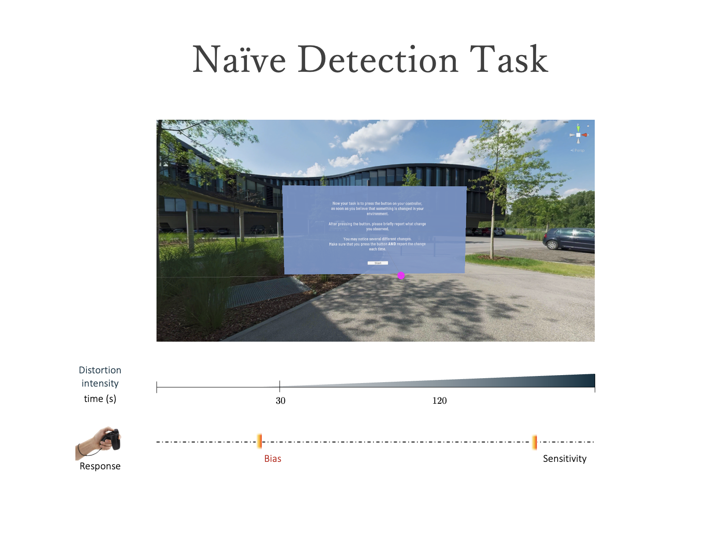

<!-- <div style="text-align: center; padding-top: 2em; font-size: 2.2em; font-family: 'Alata', sans-serif;"> -->

<!-- Altered Perception in Psychosis -->
<!-- </div> -->

<!-- <hr style="width:60%;"> -->

<!-- <div style="text-align: center; padding-top: 0em; font-size: 1em;"> -->

<!-- </div> -->


<div style="text-align: center; padding-top: 4em; font-size: 1.5em; font-family: 'Cardo', serif;">
"In our opinion, prevention of psychosis in the pre-psychotic precursor stages is possible."
</div>
<div style="text-align: right; padding-top: 0.5em; font-size: 1em; font-family: 'Cardo', serif;">
— Gerd Huber, 1987
</div>

<hr style="width:60%;">

 <div style="text-align: justify;font-size: 1em;">

Psychosis is characterized by hallucinations and delusions (fixed false beliefs). However, for most patients, the onset of full-blown psychotic symptoms is preceded by subtler changes in perception, thought and beliefs, which seem to be attenuated forms of hallucinations and delusions, respectively. The question remains whether these experiences in psychosis-prone individuals are fundamentally driven by perceptual anomalies or higher-order cognitive processes.
</div>


<div style="text-align: center; font-size: 1em;">
<br>
 Take a closer look at Mona. Do you notice anything unusual? What does that do to you? <br>
<br></div>


<div style="text-align: center; padding-top: 2em;">
<video width="60%" controls autoplay muted>
  <source src="videos/Mona_trimmed.mp4" type="video/mp4"> </video>
</div>


<!-- <div style="text-align: left; padding-top: 0em; font-size: 1.2em; font-family: 'Alata', sans-serif;"> -->
<!-- Visual Distortions in Psychosis  -->
<!-- </div> -->

<div style="text-align: justify; font-size: 1em;">
<br><br>
Visual distortions in individuals at high risk for psychosis are associated with a poor prognosis, including conversion to full-blown psychosis. We have collaborated with <a href="https://www.symmetric-vision.xyz/">Symmetric Vision</a>, a visual artist, to replicate some of the most commonly reported visual distortions in virtual reality (VR). These include changes in clarity, brightness, shape, color, motion, and persistent patterns.
<br></div>


 ```{r, echo=FALSE, out.width = "100%"}
 
 
 ```
 
 <div style="text-align: justify;font-size: .7em; line-height: 1.7; ">
Visual distortions simulations, that we generated based on 360° videos recorded in Basel, Switzerland in various settings of daily life (e.g., gym, park, and restaurant) and openly available online materials (<a href="www.eso.org">www.eso.org</a>). These videos were provided to a visual artist, along with descriptions of visual distortions commonly experienced by patients on the psychosis spectrum. Psychotic-like visual distortions were superimposed onto the 360° base materials across different VR scenarios. Here we display a set of six visual distortions, comprising alterations in brightness, metachromopsia (color alterations), visual patterns, pseudo-movement, and peripheral shadows.
</div>

<hr style="width:60%;">


<!-- <div style="text-align: center; padding-top: 4em; font-size: 1.5em; font-family: 'Cardo', serif;"> -->
<!-- On the clinical side ... -->
<!-- </div> -->

<!-- <div style="text-align: left; padding-top: 0em; font-size: 1.2em; font-family: 'Alata', sans-serif;"> -->
<!-- On the clinical side ...   -->
<!-- </div> -->


<div style="text-align: justify; font-size: 1em;">
On the clinical side, we have developed a <a href="https://redcap.research.yale.edu/surveys/?s=5778BwMMjiwuGUC6">Visual Distortion Screener</a> to show these simulations both on a computer screen and in VR. This screener is designed to assess experiences of visual distortions in patients on the psychosis spectrum by providing visual illustrations of these distortions. Unlike earlier measures, our novel semi-structured interview does not rely on verbal descriptions of visual phenomena, which could hinder accurate reporting of experienced symptoms.
<br></div>
<br>


```{r, echo=FALSE}


```


<div style="text-align: justify;font-size: 1em; line-height: 1.7; ">
After showing the videos, the participant will be asked to briefly describe the visual distortion that they saw to confirm that they identified the target distortion and then asked, “Have you seen something like this in your everyday life?” If the participant endorses having experienced the distortion, they will be asked a set of questions probing the frequency, duration, intrusiveness, and distress of the distortion within the past month and during the “worst time”.

</div>

<hr style="width:60%;">


<!-- <div style="text-align: center; padding-top: 4em; font-size: 1.5em; font-family: 'Cardo', serif;"> -->
<!-- On the mechanistic side ...   -->
<!-- </div> -->

<!-- <div style="text-align: left; padding-top: 0em; font-size: 1.2em; font-family: 'Alata', sans-serif;"> -->
<!-- On the mechanistic side ...   -->
<!-- </div> -->

<div style="text-align: center; padding-top: 4em; font-size: 1.5em; font-family: 'Cardo', serif;">
Predictive Processing
</div>


<div style="text-align: justify; font-size: 1em;">
According to the Predictive Coding hypothesis of psychosis, perceptual disturbances are thought to arise from aberrant perceptual inference due to imprecise integration of internal predictions and incoming sensory data4,15,16,25,53–55. However, different research groups have targeted specific mechanisms across the cortical hierarchy, providing evidence for each proposed mechanism. It remains inconclusive whether visual disturbances originate from abnormal perceptual sensitivity or heightened sensory expectations or both2. 
</div>


<!-- <div style="text-align: justify; font-size: 1em;"> -->
<!-- On the mechanistic side, we have developed three novel perceptual decision-making tasks in VR, with which we aim to dissect participant-specific sensitivity to psychosis-like visual distortions and cognitive bias towards false percepts (hallucination-like perceptions). These tasks are  -->
<!-- </div> -->

```{r, echo=FALSE}
knitr::include_graphics("images/pp.png")

```
 <div style="text-align: center;font-size: .7em; line-height: 1.7; ">
Adapted from: Sterzer, P., et al., (2018). Biological psychiatry.
</div>

<hr style="width:60%;">

<!-- <br> -->
<!-- <ul> -->
<!--     <li>Naïve Detection Task, probing participants' spontaneous susceptibility to false perceptions and visual sensitivity when only knowing that there may be visual changes.</li> -->
<!--     <li>Two-Interval Forced-Choice (2-IFC) Task, isolating visual sensitivity from cognitive bias using a psychophysical procedure.</li> -->
<!--     <li>Perceptual Uncertainty Task, inducing false percepts by varying perceptual uncertainty over time.</li> -->
<!-- </ul> -->
<!-- <br></div> -->

<!-- <div style="text-align: justify;font-size: 1em;"> -->
<!-- we have developed three novel perceptual decision-making tasks in VR, with which we aim to dissect participant- specific sensitivity to psychosis-like visual distortions and cognitive bias towards false percepts (hallucination-like perceptions). -->
<!-- These tasks are: 1) A Naïve Detection Task aimed at probing participants' spontaneous susceptibility to false perceptions when only knowing that there may be changes in a VR environment. 2) A Two-Interval Forced-Choice (2-IFC) Task, isolating perceptual sensitivity from cognitive bias using a psychophysical procedure. 3) A Perceptual Uncertainty Task, aimed at inducing false percepts by varying perceptual uncertainty over time. -->
<!-- <br></div> -->


```{r, echo=FALSE}


```
<div style="text-align: justify;font-size: 1em; line-height: 1.7; ">
The Naïve Detection Task is designed to assess spontaneous false percepts and perceptual sensitivity in detecting an unknown visual distortion in naturalistic VR scenarios. In each VR scenario, participants are first instructed to explore their environment for 20 seconds and to verbally describe what they observe. After this baseline exploration, participants are instructed that the upcoming task assesses their ability to detect changes in their environment. They are told to press a button on the VR controller as soon as they believe that something is changed. After pressing the button, they should verbally describe the observed change in two to three words. Importantly, participants do not know about the following task structure. For the initial 30 seconds of the task, no changes are introduced to capture potential false detections. Then, the target distortion is faded in gradually over 90 seconds. Throughout this total duration of 120 seconds, all button presses, and corresponding verbal reports as well as gaze behavior are recorded by the VR device. 
</div>

<hr style="width:60%;">


```{r, echo=FALSE}


```
<div style="text-align: justify;font-size: 1em; line-height: 1.7; ">
The Naïve Detection Task is designed to assess spontaneous false percepts and perceptual sensitivity in detecting an unknown visual distortion in naturalistic VR scenarios. In each VR scenario, participants are first instructed to explore their environment for 20 seconds and to verbally describe what they observe. After this baseline exploration, participants are instructed that the upcoming task assesses their ability to detect changes in their environment. They are told to press a button on the VR controller as soon as they believe that something is changed. After pressing the button, they should verbally describe the observed change in two to three words. Importantly, participants do not know about the following task structure. For the initial 30 seconds of the task, no changes are introduced to capture potential false detections. Then, the target distortion is faded in gradually over 90 seconds. Throughout this total duration of 120 seconds, all button presses, and corresponding verbal reports as well as gaze behavior are recorded by the VR device. 
</div>

<hr style="width:60%;">


```{r, echo=FALSE}
knitr::include_graphics("images/PUT.png")

```
<div style="text-align: justify;font-size: 1em; line-height: 1.7; ">
The Naïve Detection Task is designed to assess spontaneous false percepts and perceptual sensitivity in detecting an unknown visual distortion in naturalistic VR scenarios. In each VR scenario, participants are first instructed to explore their environment for 20 seconds and to verbally describe what they observe. After this baseline exploration, participants are instructed that the upcoming task assesses their ability to detect changes in their environment. They are told to press a button on the VR controller as soon as they believe that something is changed. After pressing the button, they should verbally describe the observed change in two to three words. Importantly, participants do not know about the following task structure. For the initial 30 seconds of the task, no changes are introduced to capture potential false detections. Then, the target distortion is faded in gradually over 90 seconds. Throughout this total duration of 120 seconds, all button presses, and corresponding verbal reports as well as gaze behavior are recorded by the VR device. 
</div>

<hr style="width:60%;">


```{r setup, include=FALSE}
knitr::opts_chunk$set(echo = FALSE)
```

```{css}
d-title {
    display: none;
  }
```

