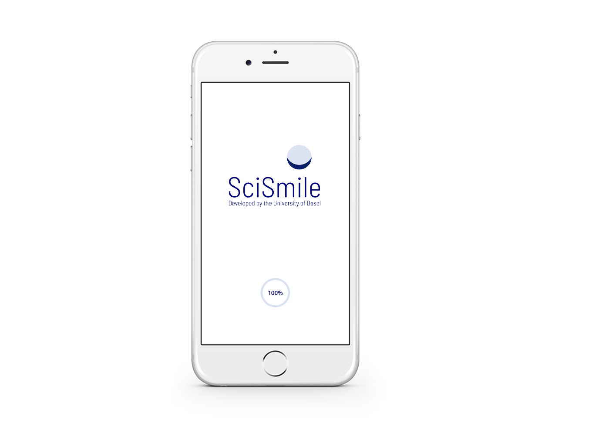
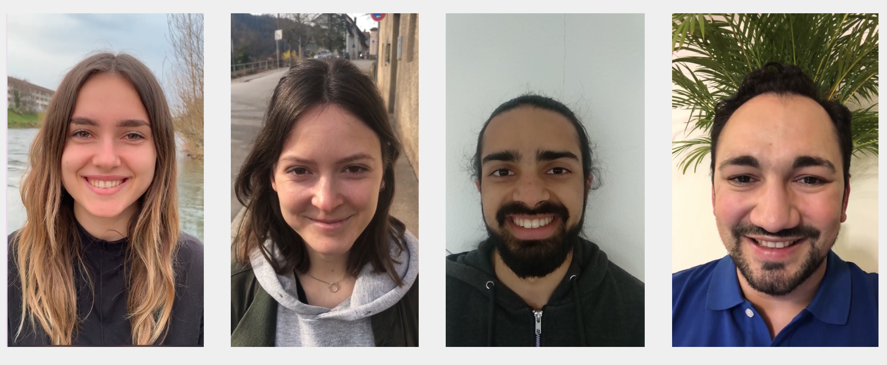
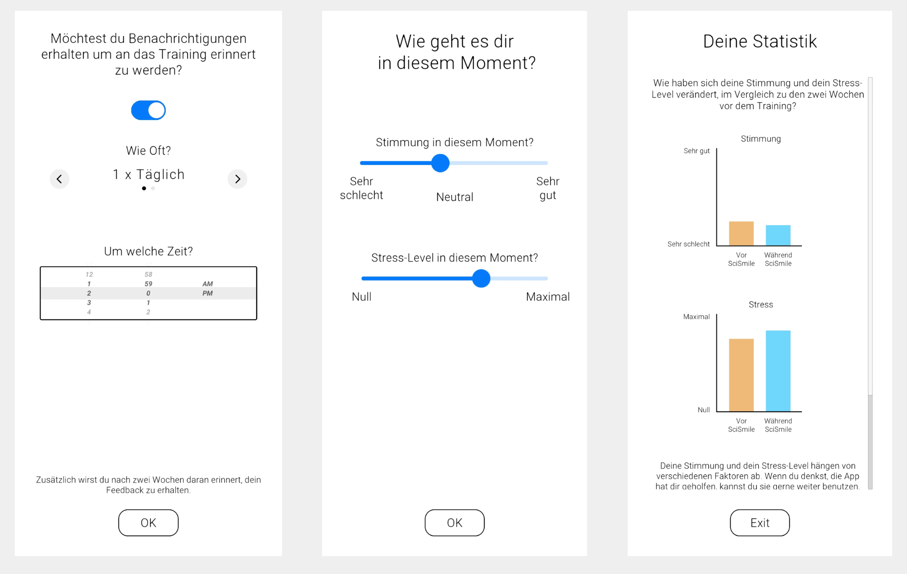
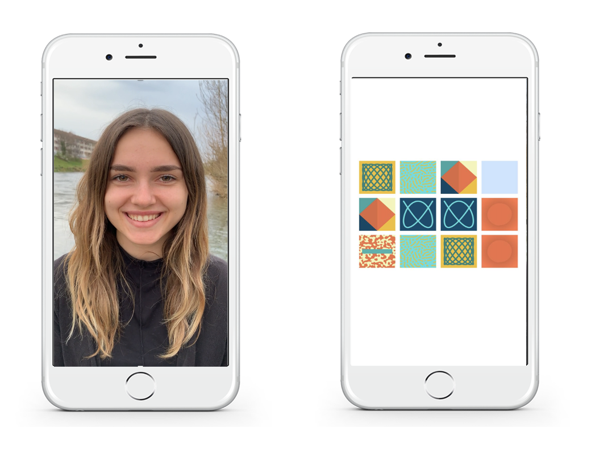

<div style="text-align: center; padding-top: 2em; font-size: 2.2em; font-family: 'Alata', sans-serif;">

SciSmile

</div>

<div style="text-align: center; padding-top: 0em; font-size: 1em;">
With <a href="https://mcn.unibas.ch/de/publications/mobile-apps/scimem/">SciSmile</a>, we aim to offer a scientifically-grounded, straightforward tool to promote psychological well-being and resilience in the face of stress.
<br>
</div>


```{r, echo=FALSE, out.width = "100%"}


```


<div style="text-align: justify;font-size: 1em;">

SciSmile is a smartphone application designed to improve well being and reduce stress through the power of smiling. SciSmile simulates reciprocal smiling interactions using videos of smiling people. The app tracks when users smile and triggers a responsive video of a person smiling back, thereby creating positive social feedback. 
</div>

<hr style="width:60%;">
```{r, echo=FALSE, out.width = "100%"}


```


```{r, echo=FALSE, out.width = "100%"}


```


<hr style="width:60%;">

<div style="text-align: left; padding-top: 0em; font-size: 1.2em; font-family: 'Alata', sans-serif;">
Can it effectively reduce stress?

</div>

<div style="text-align: justify; font-size: 1em; line-height: 1.7;">


We launched the SciSmile app on both the Android and Apple App stores in 2021 to assess its appeal and effectiveness in the general population. The primary focus was to determine if such an intervention could effectively reduce stress levels and elevate mood. Preliminary results from our anonymous online pilot study in Switzerland suggest that a two-week training with SciSmile has strong potential for reducing stress and enhancing mood.

One year later, we launched SciMem, a simple smartphone memory game app. Interestingly, we found comparable effects.

Thus, it remains to be determined whether these beneficial effects are primarily the result of the apps or if they could be attributed to other factors such as placebo effects or regression to the mean. To answer this question, we are currently conducting a three-arm RCT to test the efficacy of SciSmile and SciMem, compared to a waitlist control. The trial is currently ongoing and preregistered on OSF. 
</div>

```{r, echo=FALSE, out.width = "100%"}


```

 <div style="text-align: center;font-size: .7em; line-height: 1.7; ">
Example Screenshots from the SciSmile & SciMem App. Left: SciSmile; Right: SciMem.
</div>

<hr style="width:60%;">

	             


```{r setup, include=FALSE}
knitr::opts_chunk$set(echo = FALSE)
```

```{css}
d-title {
    display: none;
  }
```

