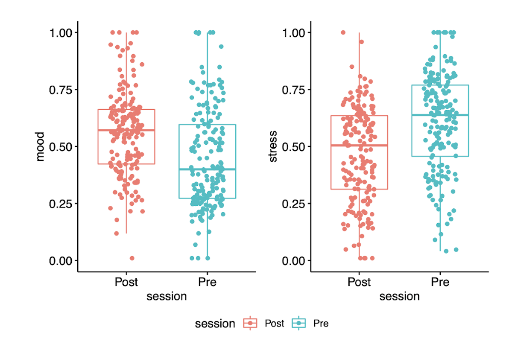

<div style="text-align: center; padding-top: 2em; font-size: 2.2em; font-family: 'Alata', sans-serif;">

SciSmile

</div>

<div style="text-align: center; padding-top: 0em; font-size: 1em;">
With <a href="https://mcn.unibas.ch/de/publications/mobile-apps/scimem/">SciSmile</a>, we aim to offer a scientifically-grounded, straightforward tool to promote psychological well-being and resilience in the face of stress.
<br>
</div>


```{r, echo=FALSE, out.width = "100%"}
knitr::include_graphics("images/scismile8.png")

```


<div style="text-align: justify;font-size: 1em;">

SciSmile is a smartphone application designed to improve well being and reduce stress through the power of smiling. SciSmile simulates reciprocal smiling interactions using videos of smiling people. The app tracks when users smile and triggers a responsive video of a person smiling back, thereby creating positive social feedback. 
</div>

<hr style="width:60%;">


<div style="text-align: center; padding-top: 0em; font-size: 1.2em; font-family: 'Alata', sans-serif;">
A Glimpse of the App
</div>

```{r, echo=FALSE, out.width = "100%"}
knitr::include_graphics("images/scismile2.png")

```


```{r, echo=FALSE, out.width = "100%"}
knitr::include_graphics("images/scismile1.png")

```


<hr style="width:60%;">

<div style="text-align: left; padding-top: 0em; font-size: 1.2em; font-family: 'Alata', sans-serif;">
But Can It Effectively Reduce Stress?
</div>

<div style="text-align: justify; font-size: 1em; line-height: 1.7;">


We launched the SciSmile app on both the Android and Apple App stores in 2021 to assess its appeal and potential effectiveness in the general population. The primary focus was to determine if such an intervention could effectively reduce stress levels and elevate mood. Preliminary results from an anonymous online pilot study in Switzerland showed that a two-week training with SciSmile has strong potential for reducing stress and enhancing mood.

<br>


```{r, echo=FALSE, out.width = "80%", fig.align = "center"}



```

However, we could not conclude whether these beneficial effects were primarily the result of the smiling intervention or if they could be attributed to other factors such as placebo effects or regression to the mean. To get a better idea we launched a second app, SciMem, a simple smartphone memory game app. And, interestingly, we found comparable effects.


Thus, it remains to be determined what explains the beneficial effects observed in both our apps. To answer this question, we are currently conducting a three-arm RCT to test the efficacy of SciSmile and SciMem, compared to a waitlist control. 
</div>

<hr style="width:60%;">

<div style="text-align: center; padding-top: 0em; font-size: 1.2em; font-family: 'Alata', sans-serif;">
The Efficacy of SciSMile vs SciMem on Stress: A Three-Arm RCT
</div>

```{r, echo=FALSE, out.width = "100%"}
knitr::include_graphics("images/comparison.png")

```

 <div style="text-align: center;font-size: .7em; line-height: 1.7; ">
Example Screenshots from the SciSmile & SciMem App. Left: SciSmile; Right: SciMem.
</div>

<hr style="width:60%;">

<div style="text-align: center; font-size: 1.5em;">
<br>
More information about the study coming soon.
</div>


	        
<!-- The trial is currently ongoing and preregistered on OSF. We are excited to see the results and hope to gain a better understanding of the mechanisms underlying the beneficial effects of these apps. -->


```{r setup, include=FALSE}
knitr::opts_chunk$set(echo = FALSE)
```

```{css}
d-title {
    display: none;
  }
```

